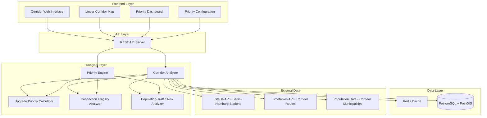

# Design Document: Berlin-Hamburg Corridor Analysis System

## Overview

The Berlin-Hamburg Corridor Analysis System is a web-based decision aid that analyzes the critical Berlin-Hamburg railway corridor to identify:

1. **Station upgrade priorities** - Which stations need infrastructure investment first
2. **Fragile timetable connections** - Where connection design is vulnerable to disruption
3. **Population-traffic risk zones** - Where high density plus heavy traffic creates maximum disruption impact

The system provides user-configurable priority settings, allowing planners to adjust focus based on current strategic requirements. The application delivers specific, actionable recommendations for this key long-distance corridor.

## Architecture

### System Architecture



### Technology Stack

**Frontend:**
- React.js with TypeScript
- Leaflet.js for interactive mapping
- Material-UI for design system

**Backend:**
- Node.js with Express.js
- PostgreSQL with PostGIS for spatial data
- Redis for caching
- GDAL/OGR for processing Shapefile data

**Infrastructure:**
- Docker containers for deployment
- Cloud deployment ready (AWS/Azure/GCP)

## Components and Interfaces

### Web Interface Component

**Linear Corridor Map View:**
- Linear representation of the Berlin-Hamburg corridor showing all stations in sequence
- Color-coded stations indicating upgrade priority (green/yellow/red)
- Connection lines between stations showing fragility levels
- Population density overlay for municipalities along the corridor
- Click-to-zoom functionality for detailed station analysis

**Priority Configuration Panel:**
- User controls for adjusting analysis priorities:
  - Infrastructure focus (station capacity, facilities, platforms)
  - Timetable focus (connection reliability, buffer times)
  - Population risk focus (disruption impact, passenger volume)
- Real-time recalculation when priorities change
- Save/load priority configurations

**Corridor Dashboard:**
- Top 5 stations requiring immediate upgrade attention
- Most fragile timetable connections with specific recommendations
- Highest population-traffic risk zones
- Overall corridor health score and trend indicators

**Station Detail Panel:**
- Comprehensive metrics for selected corridor stations
- Upgrade priority score breakdown
- Connection fragility analysis
- Population impact assessment
- Specific recommendations with cost-benefit estimates

### Data Processing Pipeline

**Core Data Structures:**
```typescript
interface CorridorStation {
  eva: number;
  name: string;
  coordinates: [number, number];
  distanceFromBerlin: number; // km along corridor
  category: number;
  platforms: number;
  facilities: StationFacilities;
  upgradePriority: number; // 0-100
  isStrategicHub: boolean;
}

interface UpgradePriorityMetrics {
  trafficVolume: number;
  capacityConstraints: number;
  strategicImportance: number;
  facilityDeficits: number;
  compositeScore: number; // 0-100
}

interface ConnectionFragility {
  fromStation: number;
  toStation: number;
  bufferTime: number; // minutes
  fragilityScore: number; // 0-100
  cascadeRisk: number;
  alternativeRoutes: number;
  recommendations: string[];
}

interface PopulationTrafficRisk {
  municipalityId: string;
  corridorSegment: string;
  population: number;
  dailyTrafficVolume: number;
  disruptionImpactScore: number; // 0-100
  riskLevel: 'low' | 'medium' | 'high';
}

interface PriorityConfiguration {
  infrastructureWeight: number; // 0-1
  timetableWeight: number; // 0-1
  populationRiskWeight: number; // 0-1
  focusArea: 'infrastructure' | 'timetable' | 'population' | 'balanced';
}
```

### Analysis Algorithms

**Station Upgrade Priority Calculation:**
- Traffic volume analysis based on daily arrivals/departures
- Capacity constraint assessment (platforms vs. demand)
- Strategic importance scoring (corridor position, connection hub status)
- Facility deficit analysis (missing passenger amenities)
- User-configurable weighting system
- Composite scoring with clear ranking methodology

**Connection Fragility Analysis:**
- Buffer time analysis between connecting trains
- Cascade delay risk assessment
- Alternative route availability evaluation
- Historical delay pattern analysis
- Real-time timetable vulnerability scoring

**Population-Traffic Risk Assessment:**
- Population density mapping along corridor municipalities
- Daily traffic volume correlation
- Disruption impact modeling (passengers affected per hour of outage)
- Risk zone identification and prioritization
- Service continuity planning recommendations

## Data Models

### Database Schema

```sql
-- Berlin-Hamburg corridor stations
CREATE TABLE corridor_stations (
    eva BIGINT PRIMARY KEY,
    name VARCHAR(255) NOT NULL,
    coordinates POINT NOT NULL,
    distance_from_berlin INTEGER, -- km
    category INTEGER,
    platform_count INTEGER,
    facilities JSONB,
    is_strategic_hub BOOLEAN DEFAULT FALSE
);

-- Station upgrade priority analysis
CREATE TABLE station_upgrade_priorities (
    eva BIGINT REFERENCES corridor_stations(eva),
    analysis_date DATE,
    traffic_volume INTEGER,
    capacity_constraints DECIMAL(5,2),
    strategic_importance DECIMAL(5,2),
    facility_deficits DECIMAL(5,2),
    upgrade_priority_score DECIMAL(5,2),
    PRIMARY KEY (eva, analysis_date)
);

-- Connection fragility analysis
CREATE TABLE connection_fragility (
    from_eva BIGINT REFERENCES corridor_stations(eva),
    to_eva BIGINT REFERENCES corridor_stations(eva),
    analysis_date DATE,
    buffer_time INTEGER, -- minutes
    fragility_score DECIMAL(5,2),
    cascade_risk DECIMAL(5,2),
    alternative_routes INTEGER,
    PRIMARY KEY (from_eva, to_eva, analysis_date)
);

-- Population-traffic risk zones
CREATE TABLE population_traffic_risk (
    municipality_id VARCHAR(20),
    corridor_segment VARCHAR(100),
    analysis_date DATE,
    population INTEGER,
    daily_traffic_volume INTEGER,
    disruption_impact_score DECIMAL(5,2),
    risk_level VARCHAR(10),
    PRIMARY KEY (municipality_id, analysis_date)
);

-- User priority configurations
CREATE TABLE priority_configurations (
    user_id VARCHAR(50),
    config_name VARCHAR(100),
    infrastructure_weight DECIMAL(3,2),
    timetable_weight DECIMAL(3,2),
    population_risk_weight DECIMAL(3,2),
    focus_area VARCHAR(20),
    created_at TIMESTAMP DEFAULT NOW(),
    PRIMARY KEY (user_id, config_name)
);
```

### API Endpoints

```typescript
// Corridor station analysis
GET /api/corridor/stations
interface CorridorStationsResponse {
  stations: {
    eva: number;
    name: string;
    distanceFromBerlin: number;
    upgradePriority: number;
    priorityLevel: 'low' | 'medium' | 'high';
    recommendations: string[];
  }[];
  corridorHealth: {
    overallScore: number;
    criticalStationsCount: number;
    averageUpgradePriority: number;
  };
}

// Connection fragility analysis
GET /api/corridor/connections/fragility
interface ConnectionFragilityResponse {
  connections: {
    fromStation: string;
    toStation: string;
    fragilityScore: number;
    bufferTime: number;
    cascadeRisk: number;
    recommendations: string[];
  }[];
  mostVulnerableConnections: string[];
}

// Population-traffic risk zones
GET /api/corridor/risk-zones
interface RiskZonesResponse {
  riskZones: {
    municipalityId: string;
    name: string;
    population: number;
    trafficVolume: number;
    disruptionImpactScore: number;
    riskLevel: 'low' | 'medium' | 'high';
  }[];
  highestRiskAreas: string[];
}

// Priority configuration
POST /api/corridor/priorities/configure
interface PriorityConfigRequest {
  infrastructureWeight: number;
  timetableWeight: number;
  populationRiskWeight: number;
  focusArea: 'infrastructure' | 'timetable' | 'population' | 'balanced';
}

// Corridor dashboard
GET /api/corridor/dashboard
interface CorridorDashboardResponse {
  topUpgradePriorities: {
    eva: number;
    name: string;
    urgencyScore: number;
    estimatedCost: string;
    expectedImpact: string;
  }[];
  mostFragileConnections: {
    route: string;
    fragilityScore: number;
    recommendedAction: string;
  }[];
  highestRiskZones: {
    area: string;
    impactScore: number;
    affectedPopulation: number;
  }[];
}
```

## Correctness Properties

*A property is a characteristic or behavior that should hold true across all valid executions of a system-essentially, a formal statement about what the system should do. Properties serve as the bridge between human-readable specifications and machine-verifiable correctness guarantees.*

### Converting EARS to Properties

**Property 1: Corridor Data Integrity**
*For any* station identified as part of the Berlin-Hamburg corridor, the system should successfully load infrastructure and timetable data and position it correctly along the linear corridor route
**Validates: Requirements 1.1, 1.2, 1.3**

**Property 2: Upgrade Priority Consistency** 
*For any* corridor station with valid infrastructure and traffic data, the upgrade priority calculator should produce a score between 0-100 that correctly incorporates traffic volume, capacity constraints, strategic importance, and facility deficits
**Validates: Requirements 2.1, 2.2, 2.3**

**Property 3: User Priority Configuration**
*For any* valid priority configuration with weights summing to 1.0, the system should recalculate all station rankings and connection assessments to reflect the new priority focus
**Validates: Requirements 5.1, 5.2, 5.3**

**Property 4: Connection Fragility Assessment**
*For any* timetable connection along the Berlin-Hamburg corridor, the fragility analyzer should correctly assess buffer time adequacy and cascade risk based on downstream connection dependencies
**Validates: Requirements 3.1, 3.2, 3.3**

**Property 5: Population-Traffic Risk Calculation**
*For any* municipality along the corridor with population and traffic data, the system should correctly calculate disruption impact scores based on population density and daily traffic volume
**Validates: Requirements 4.1, 4.2, 4.3**

**Property 6: Linear Corridor Visualization**
*For any* corridor station or connection data, the web interface should render elements in correct linear sequence from Berlin to Hamburg with appropriate color coding for priority levels
**Validates: Requirements 6.1, 6.2, 6.3**

**Property 7: Corridor-Specific Recommendations**
*For any* identified critical station or fragile connection, the system should generate specific, actionable recommendations focused on Berlin-Hamburg corridor improvements rather than generic suggestions
**Validates: Requirements 7.1, 7.2, 7.3**

## Error Handling

### Corridor-Specific Error Handling
- Handle missing station data gracefully along the Berlin-Hamburg route
- Provide fallback when timetable data is unavailable for corridor connections
- Validate corridor station sequence and distances
- Handle priority configuration edge cases (weights not summing to 1.0)

### Analysis Error Handling
- Handle division by zero in upgrade priority calculations
- Provide bounds checking for all scoring algorithms (0-100 scales)
- Use safe defaults when corridor station data is incomplete
- Implement timeouts for corridor-wide analysis operations

### User Interface Error Handling
- Provide fallback when corridor station coordinates are invalid
- Handle zoom levels that exceed corridor boundaries
- Show loading states during corridor data fetching
- Gracefully handle priority configuration errors

## Testing Strategy

### Dual Testing Approach

**Unit Tests:**
- Test specific upgrade priority calculations with known Berlin-Hamburg station data
- Verify corridor station sequencing and distance calculations
- Test priority configuration changes with controlled scenarios
- Validate connection fragility scoring with sample timetable data

**Property-Based Tests:**
- Verify upgrade priority calculations across randomly generated corridor station data
- Test connection fragility algorithms with various timetable configurations
- Validate priority recalculation with different user weight configurations
- Ensure corridor visualization consistency across different data volumes

### Property-Based Testing Configuration

**Testing Framework:** fast-check (JavaScript/TypeScript property-based testing library)

**Test Configuration:**
- Minimum 100 iterations per property test
- Each property test references its corresponding design document property
- Tag format: **Feature: critical-nodes-analysis, Property {number}: {property_text}**

**Generator Strategy:**
- Corridor-specific station generators (Berlin to Hamburg sequence)
- Realistic timetable generators respecting corridor travel times
- Priority configuration generators with valid weight distributions
- Population data generators reflecting actual corridor demographics